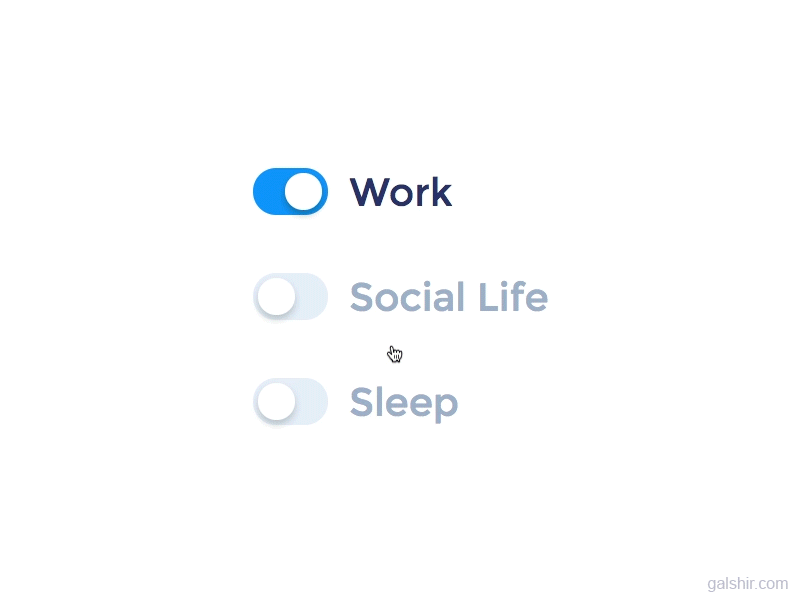

<!-- ### Hello World!  -->

<p align="left">

# Hi, I'm Keerthi Gowda! 

## I'm a Student and a Data Science enthusiast!

- 🌱 I’m currently learning Deep learning
- 👯 I’m looking to collaborate on TensorFlow
- 🤔 I’m looking for help with Data Analysis
- 💬 Ask me about Python


</p>

## Experienced with 
<p align="center" >
<code>  </code>
<code>  </code>
<code>  </code>
<code>  </code>
<code>  </code>
<code>  </code>
<code>  </code>
<code>  </code>
<code>  </code>
<code>  </code>
<code>  </code>
<code>  </code>

### 🛠 Other Softwares I Use : 

<a href="https://code.visualstudio.com/"> </a>
<a href="https://www.photoshop.com/en" target="_blank">  </a>
<a href="https://www.adobe.com/in/products/photoshop-lightroom.html" target="_blank">  </a>
<a href="https://www.adobe.com/in/products/premiere.html" target="_blank">  </a>

<br />


<hr>
<!--START_SECTION:waka-->

**I'm a Night 🦉** 

<p>
    
</p>


📊 **This Week I Spent My Time On** 

```text
⌚︎ Time Zone: IST

💬 Programming Languages: 
No Activity Tracked This Week

```


<!--END_SECTION:waka-->


##  A little more about me...

```py
class hyperwolf248:
    def __init__(self):
        self.username = 'hyperwolf248'
        self.age = 21
        self.name = 'Keerthi Gowda'
        self.languages = {
            "English":  "Intermediate",
            "Hindi":   "Native language"
        }
        self.education = {
            "Programming": (
                ["Python & Javascript", "Self Education"],
                ["Linux Usage", "Self Education"]
            ),
            "B.E": "RV College of Engineering",
        }
    def __str__(self):
        return self.name
if __name__ == '__main__':
    me = hyperwolf248()
```
## 

<hr>

<p align="center">
  <a href="https://github.com/hyperwolf248">
    
    
  </a>
</p>
